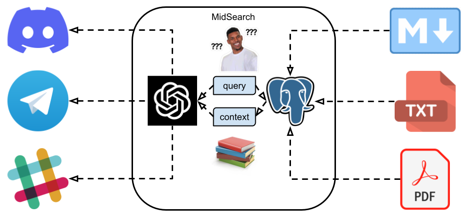

# MidSearch

<p align="center">

</p>

[](https://hub.docker.com/r/zhenghaoz/midsearch)
[](https://hub.docker.com/r/zhenghaoz/midsearch)
[](https://hub.docker.com/r/zhenghaoz/midsearch)

MidSearch is a middleware to connect chat bots to documents search (powered by Postgres). It gerenetes human friendly answers to user questions based on ingested documents. Besides its basic question answering ability, MidSearch also supports more advanced features:

- **Observality**: Conversactions between users and chat bots are recorded and can be used to improve documents.
- **Evaluation**: Users or administrators can rate the quality of answers to questions to track the quality of documents.
- **Multi-platform**: MidSearch can be used by chat bots on different platforms, such as Telegram, Discord, etc.


## Demos

There are two demos of MidSearch:

| Telegram Bot | Documents Source | Language | Tutorial |
|-|-|-|-|
| [程序员做饭指南](https://t.me/how_to_cook_bot) | [Anduin2017/HowToCook](https://github.com/Anduin2017/HowToCook) | Chinese (Simplified) | [如何搭建一个菜谱机器人](./examples/how-to-cook-bot/) |
| [Gorse Support AI](https://t.me/gorse_support_bot) | [gorse-io/docs](https://github.com/gorse-io/docs) | English | [How to Setup a Gorse Support Bot](./examples/gorse-support-bot/) |

## Deploy

1. Clone the repository:

```bash
git clone git@github.com:gorse-io/midsearch.git
cd midsearch
```

2. Create a `.env` file in the root directory of the project:

```bash
# OpenAI API key
OPENAI_API_KEY=sk-xxxxxxxx

# MidSearch API key
MIDSEARCH_API_KEY=xxxxxxxx
# MidSearch admin username (default: admin)
MIDSEARCH_USERNAME=admin
# MidSearch admin password (default: admin)
MIDSEARCH_PASSWORD=admin
# MidSearch rate limit (default: 30/hour)
MIDSEARCH_RATE_LIMIT=30/hour
```

3. Start the MidSearch stack:

```bash
docker-compose up -d
```

4. Access the MidSearch admin panel at http://localhost:8080/.

## Usage

### Add/Sync Documents

1. Install the Python package:

```bash
pip install git+https://github.com/gorse-io/midsearch.git
```

2. Add documents:

```bash
export MIDSEARCH_ENDPOINT=http://localhost:8080/api/
export MIDSEARCH_API_KEY=xxxxxxxx
midsearch add /path/to/documents
```

Markdown files (*.md) in the directory will be ingested as documents. The file name will be used as the document id. The sync command is similar to the add command, except that it will delete documents that are not in the directory.

### Setup Telegram Bot

1. [Create a Telegram bot](https://sendpulse.com/knowledge-base/chatbot/telegram/create-telegram-chatbot) and paste the bot token in the `.env` file:

```bash
# Telegram Bot Token
TELEGRAM_BOT_TOKEN=xxxxxxxx
```

2. Uncomment the following lines in the `docker-compose.yml` file:

```yaml
  telegram-bot:
    build: .
    environment:
      MIDSEARCH_ENDPOINT: http://midsearch:8080/api/
      MIDSEARCH_API_KEY: ${MIDSEARCH_API_KEY}
      TELEGRAM_BOT_TOKEN: ${TELEGRAM_BOT_TOKEN}
    command: python3 midsearch/client telegram
```

3. Start the Telegram bot:

```bash
docker-compose up -d
```

### Setup Discord Bot

1. [Create a Discord bot](https://discordpy.readthedocs.io/en/stable/discord.html) and paste the bot token in the `.env` file:

```bash
# Discord Bot Token
DISCORD_BOT_TOKEN=xxxxxxxx
```

2. Uncomment the following lines in the `docker-compose.yml` file:

```yaml
  discord-bot:
    build: .
    environment:
      MIDSEARCH_ENDPOINT: http://midsearch:8080/api/
      MIDSEARCH_API_KEY: ${MIDSEARCH_API_KEY}
      DISCORD_BOT_TOKEN: ${DISCORD_BOT_TOKEN}
    command: python3 midsearch/client discord
```

3. Start the Discord bot:

```bash
docker-compose up -d
```

## TODO

- [ ] Support more search engines (Elasticsearch, etc.)
- [ ] Support more chat bots (Slack, etc.)
- [ ] Support more file formats (PDF, etc.)

## Acknowledgments

MidSearch is inspired by the following projects:

- [LangChain](https://github.com/hwchase17/langchain)
- [LlamaIndex](https://github.com/jerryjliu/llama_index)
