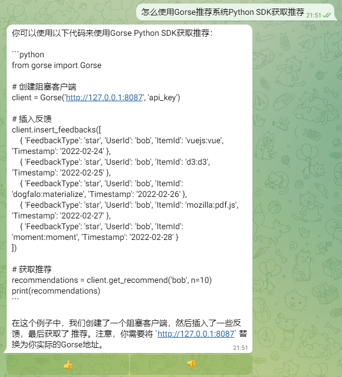

# How to Setup a Gorse Support Bot

Gorse is an open-source recommendation system written in Go. This tutorial shows how to setup a Gorse support bot based on Gorse official documents.

## Deploy MidSearch

Follow the instructions in [README.md](/README.md) to deploy MidSearch and setup a Telegram bot.

## Sync Documents

1. Clone [gorse-io/docs](https://github.com/gorse-io/docs) to local:

```bash
git clone https://github.com/gorse-io/docs.git
cd docs
```

2. Sync documents:

```bash
export MIDSEARCH_ENDPOINT=http://localhost:8080/api/
export MIDSEARCH_API_KEY=xxxxxxxx
midsearch sync src/docs/master
```

## Demo

Conversation with the bot:

| ChatGPT | MidSearch (ChaGPT + Knowledge Base) |
| ------- | --------- |
|  |  |
|  |  |

1. ChatGPT cannot answer the question about how to use the Python SDK, because it does not have any knowledge about the Python SDK.
2. MidSearch can answer the question about how to use the Python SDK, because it has the knowledge about the Python SDK.
3. The English answer from MidSearch is more accurate than the Chinese answer, because the native language of documents is English.
