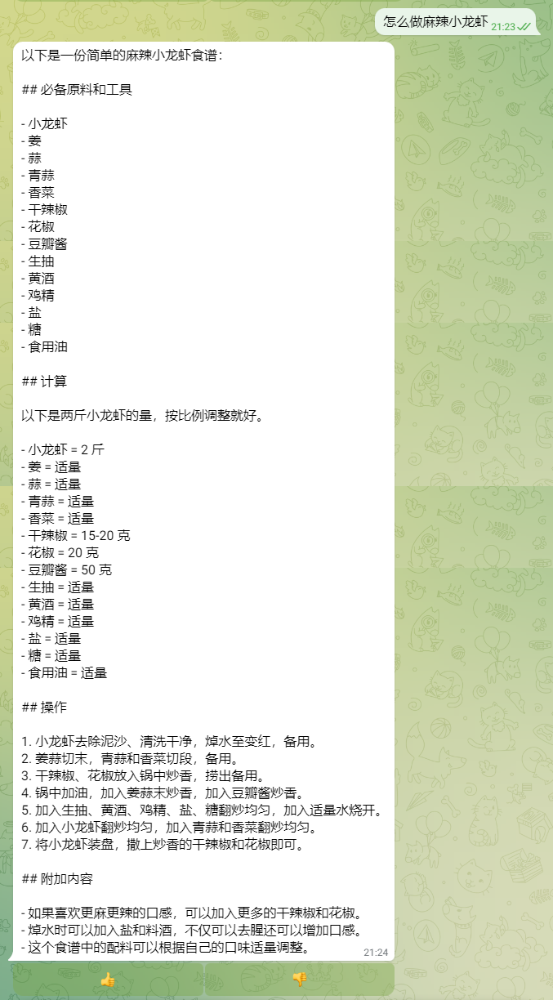

# 如何搭建一个菜谱机器人

[程序员做饭指南](https://github.com/Anduin2017/HowToCook)收集了大量的中餐菜谱，本教程基于程序员做饭指南搭建一个中文菜谱机器人。

## 部署 MidSearch

按照 [README.md](/README.md) 中的要求部署 MidSearch 并设置 Telegram 机器人。

## 导入菜谱

1. 克隆[Anduin2017/HowToCook](https://github.com/Anduin2017/HowToCook)到本地

```bash
git clone https://github.com/Anduin2017/HowToCook.git
cd HowToCook
```

2. 导入菜谱

```bash
export MIDSEARCH_ENDPOINT=http://localhost:8080/api/
export MIDSEARCH_API_KEY=xxxxxxxx
midsearch add dishes
```

## 演示

和机器人的聊天结果如下：

| ChatGPT | MidSearch (ChaGPT + 知识库) |
| ------- | --------- |
|  |  |
